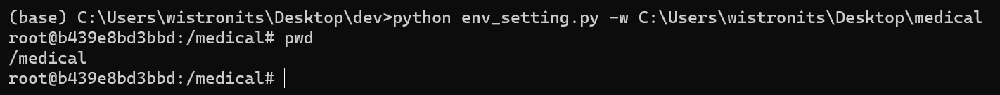

# Medical Image Setup Tutorial
> This repo is help you build developing environment quickly by using Docker technique. The image have already install some medical image process package.

### Prerequisite
1. You need to install Docker in your PC and turn on docker.
    - Windows User: Install Docker desktop and turn on WSL 2 feature on Windows. [Official document](https://docs.docker.com/desktop/install/windows-install/)
    - Mac User: [Offcial document](https://docs.docker.com/desktop/install/mac-install/)
    - Linux User: [Official document](https://docs.docker.com/desktop/install/linux-install/)
2. Install [Git](https://git-scm.com/downloads) and setup your email & username. Then use `git clone` command to download this repo.
    ````
    git config --global  user.name "Your user name"
    git config --global  user.email "Your email"
    ````
3. Open your terminal and type `pip install typer`.

### How to use
> * The env_setting.py will bind the workspace path you input to the container's work directory (/medical).
> * In this way, you can drag any file you want to test into binding folder, then we can see it in container simultaneously.
1. Execute `env_setting.py` to setup the environment
    ````
    python env_setting.py -w <Absolute Path to Your Workspace directory> -f
    ````
2. Once all of the above steps have already been finished, you will change your current position to container's work directory (/medical) :
    
3. If you want to leave the container, you can type `Ctrl + D` to exit, but the container will automatically remove.
